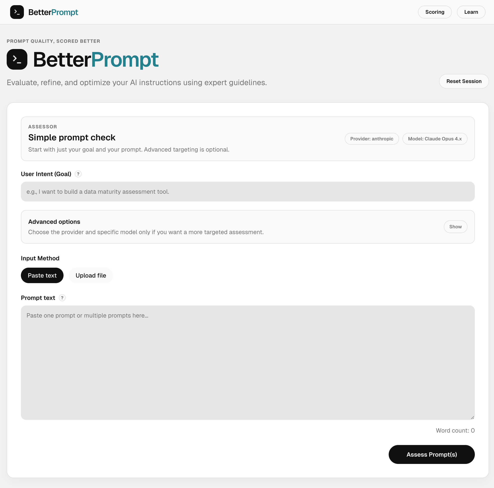

# BetterPrompt

BetterPrompt is an educational prompt-review tool. Its purpose is to evaluate prompts against prompt-engineering best practices, explain what is working and what is weak, and generate a stronger rewritten version.

The current implementation includes the assessor, provider-aware guidance, a learning tutor, deterministic guardrails, and a presentation-ready feedback experience.

## Screenshot

## Current product scope

At this stage, BetterPrompt supports:

- assessment of a single prompt or a collection of prompts
- user intent capture
- model-provider-aware evaluation with provider + model targeting
- upload and parsing of prompt files
- scoring and feedback generation
- rewritten prompt generation
- prompt-structure checks and injection detection
- BetterPrompt Tutor on the assessor and learn experiences

## Current capabilities

The current build includes:

- **Prompt input** through pasted text
- **Document ingestion** for `.pdf`, `.txt`, and `.md` files
- **Prompt extraction preview** so users can see the content that was actually assessed
- **Assessment dashboard** with:
  - overall score
  - sub-scores for clarity, context, and intent alignment
  - strengths
  - weaknesses
  - prompt structure signals
  - injection pass/fail check
  - rewritten output under **Better Prompt**
- **Copy-to-clipboard** support for the rewritten prompt
- **Learning Copilot / BetterPrompt Tutor** on the assessor and Learn pages for prompt-engineering Q&A

## Technical architecture

BetterPrompt is built as a full-stack JavaScript application using:

- **Next.js** for frontend UI and backend API routes
- **React** for the application interface
- **Tailwind CSS** for styling
- **Ollama** for local model inference
- **Gemma 4** (`gemma4:latest`) as the current local assessment model
- **Gemma 4** (`gemma4:latest`) as the local assessment and learning-copilot model
- **pdf-parse** for PDF text extraction

## Assessment flow

The current system works in the following stages:

1. The user provides a goal and either pasted prompt text or an uploaded prompt file.
2. The backend extracts raw text from the input source.
3. The system combines that text with internal prompt-engineering rules.
4. A local Ollama model evaluates the prompt strategy.
5. Deterministic guardrails validate structural signals and scan for prompt-injection attempts.
6. The model returns structured assessment data.
7. The frontend presents the results in a dashboard.

## Rules and evaluation approach

BetterPrompt currently uses a local rules matrix stored in the codebase. This matrix contains:

- universal prompt-writing rules
- Anthropic-oriented guidance
- OpenAI-oriented guidance
- Google-oriented guidance

The evaluator uses these rules as context when scoring prompts. The current implementation is designed to assess both individual prompts and multi-prompt project files as a single overall strategy.

## Current status

The project currently has working support for:

- local prompt assessment with Ollama
- prompt-file uploads
- PDF / text / markdown parsing
- multi-prompt evaluation
- dashboard-based result presentation
- learning-page chat tutoring with BetterPrompt-only internal citations
- assessor-page tutor access
- deterministic XML / structure checks
- prompt-injection and score-manipulation detection
- provider-specific learning templates for OpenAI, Anthropic, and Google

## Known future work

The following items are important next steps:

- stronger score transparency and explanation
- better prompt segmentation for multi-prompt files
- richer rule sources and expanded provider guides
- further UX improvements for presentation scenarios
